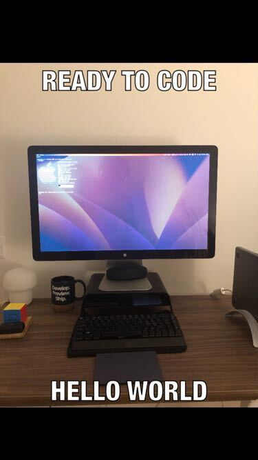

# MemeMe 1.0

Project made for iOS development Nanodegree.

The application allows users to:

- Take a photo with their camera
- Use a photo from their album

Users can input a top text and a bottom text.

Once an image is selected, users are also able to share the meme through an activity view.

Upon sharing, if the user did not explicitly save the image themselves, then the meme is saved to their photo album.

